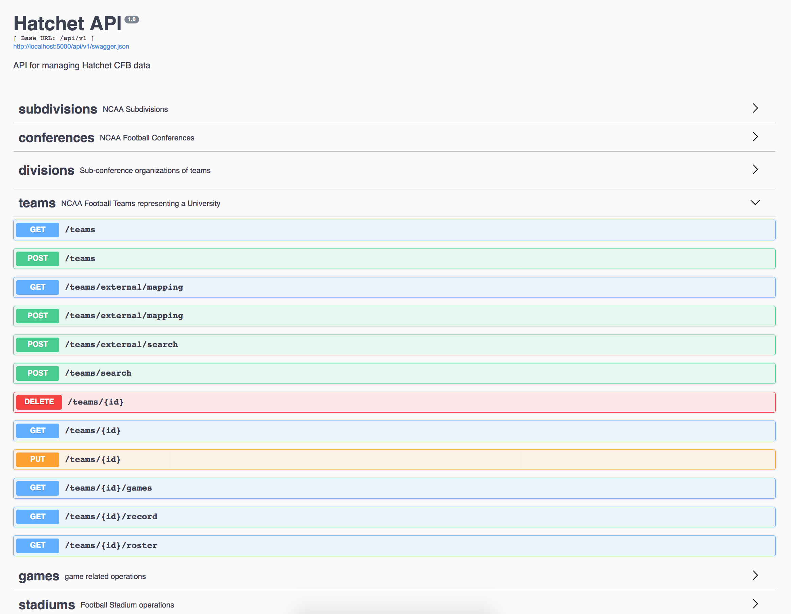
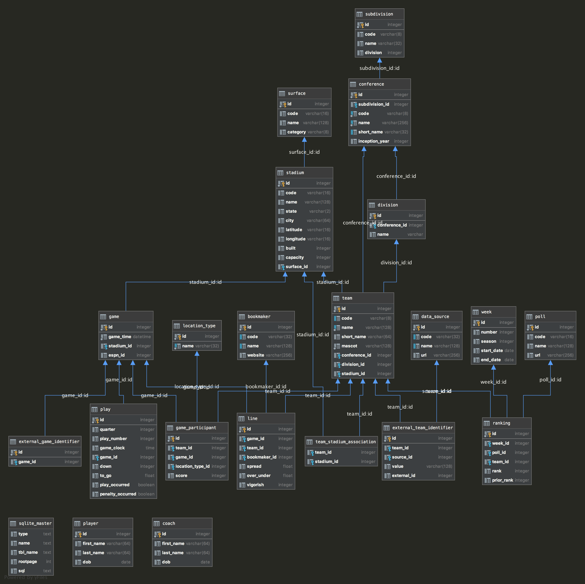

# Hatchet Pick'em
| Python back-end for College Football sports-betting analytics

[](https://travis-ci.org/exleym/Hatchet)
[](https://coveralls.io/github/exleym/Hatchet?branch=master)

Hatchet is a web application for centralizing college football data from 
a variety of sources, managing the "golden-source" of that data, and providing 
it in a usable form for analysis. 

> Does economically-driven bias in sports media induce unsophisticated gamblers 
> to push spreads to a detectable degree?

This project was born out of that single question and the need for a robust, 
powerful dataset to support research on the topic. To that end, we aim to 
simplify the data-cleaning and wrangling process surrounding general purpose 
college football analysis. 

Check out our full documentation at [GitHub Pages](https://exleym.github.io/Hatchet/)!


### Components

The Hatchet College Football toolkit is made up of several key components 
designed to work together and in conjunction with external tools. 


| Component Name       | Framework | Description                              |
| -------------------- | --------- | ---------------------------------------- |
| [Hatchet API][H1]    | Flask     | Python web API for core data model       |
| [Hatchet Client][H2] | Python    | Python client for Hatchet Web API        |
| [Axe UI][H3]         | Angular   | Web front-end for managing app data      |
| [CFB Client][H4]     | Python    | Client for fetching [CFB Data][CFBD]     |
 
#### Hatchet API
The [Hatchet Web API][H1] provides a model of the college football landscape. 
It seeks to model as many data points about each game as possible, and make 
them available in an easy to use and reliable format. 



See the [Data Model][DM] section of our full documentation for a complete list 
of the entities we model and their attributes.

* Organization Entities:
  * *Subdivision* (FBS / FCS - formerly I-A, I-AA) - just for categorizing
  * *Conference* "perceived power" could affect spread @ the margin
  * *Division* sub-conference organization (don't confuse with *Subdivision*)
  * *Team* 
* Human Entities
  * *Player* associated with plays, key individuals may be worth points
  * *Coach*
* Gameplay Entities
  * *Game* - information about who played when where
  * *Drive* - drive level data with outcomes, length, ball control, etc
  * *Play* - individual plays for creating custom advanced statistics
* Gambling Entities
  * *Bookmaker* - track and interact with various bookies
  * *Line* - betting lines for each game, includes spreads, O/U & vig data
  * *Bet* (not implemented) - track bets, outcomes, and P&L
  


#### Hatchet Client
Python client for interacting with the API. Abstrcts the HTTP / JSON 
components, but provides the data in the same schema as the Hatchet core data 
model.

```python
from hatchet.client.hatchet_client import HatchetClient

hat = HatchetClient()
bama = hat.get_team(code="BAMA")
games = hat.get_team_games(team_id=bama.id, season=2019)
```

The Hatchet Client can also be configured to bind objects instantiated by the 
client with references back to the client. This allows client objects to 
query the API for additional information, rather than acting as simple data 
containers. We recommend using this feature when interacting with the 
hatchet client directly, but the analytics client (whose purpose is to convert 
large data response objects into Pandas DataFrames for analysis) disables 
binding to ensure lightweight objects and performant queries.

```python
from hatchet.client.hatchet_client import HatchetClient

hat = HatchetClient(use_databinding=True)
clem = hat.get_team(code="CLEM")
print(clem.get_losses(season=2018))
[]
```

### Technical Architecture


### Developer's Guide
This project consists of three main components that can be used and run 
independently of one another.

* Hatchet is a Flask Python back-end for managing the data and exposing it via 
  API.
* AxeUI is an Angular front-end for interacting with and visualizing the data 
* Hatchet Client is a Python client for interacting with the API.

This section will walk you through setting up and using each component on your  
local machine. For the purpose of this tutorial we will assume you are working 
on Linux or OSX, but the same ideas generally apply to Windows, and it should 
be a fairly comparable experience.

For a more comprehensive [Developer's Guide, see our Tutorial][dev-guide].

#### Step 1: Setting up the API
Once you've cloned the project locally, change directories into the top 
`Hatchet` folder and create a virtual environment and activate it:

```bash
$ python -m virtualenv venv
$ source venv/bin/activate
(venv)$
```

Install the application dependencies into your virtual environment:

```bash
(venv)$ pip install -r requirements.txt
```

Anything that ends up missing from this requirements file can be manually 
installed via pip. 

You should now be able to start the application right away from command line 
with the boot script `wsgi.py`:

```shell script
(venv)$ python wsgi.py
```
 
 The default configs for a development environment are `dev` and `dev-stable`.
 `dev` will boot your application with a SQLite in-memory database, and 
 `dev-stable` will create a sqlite database in your project directory. Both 
 will automatically generate a schema and seed it with some static content 
 like conferences and teams. Adding larger datasets must be done manually:
 
 
 #### Step 2: Adding Games, Lines, and Ratings
 Once the application is up and running, you will want to back-fill historical 
 data. These are included as CSV files in `hatchet/static/seeds` and can be 
 populated into the application with the backfilling scripts located in 
 `scripts`. These were written to be run manually through PyCharm -- hence the 
 lack of Python-path adjustment -- so you will not be able to run them from 
 command line without a little tweaking.
 
 They also must be run from an active virtual environment with the deps 
 installed. If you are using PyCharm and have your virtualenv properly 
 configured for the project, you should be able to simply right-click on the 
 `scripts/run_complete_backfill.py` script and hit "run". It adds data 
 by sending POST requests to the API, so obviously the API must be up and 
 running to use the backfill. 
 
 If you are backfilling this data, we highly recommend using the `dev-stable` 
 environment, as `dev` will restart on any change to your application, and 
 consequently clear the in-mem database.
 
 
 #### Step 3: Starting AxeUI
 Let's assume you have the API up and running with data populated in it, 
 and you'd like to do some exploration. You need to have npm installed, and 
 it should handle itself from there.
 
 ```bash
$ cd Hatchet/AxeUI
$ npm install
$ ng serve --open  # also can use npm start 
```

This will boot your application on localhost:4200.
 

Go Tigers!


[ESPN-API]: http://www.espn.com/apis/devcenter/overview.html#api-consumer-tiers
[REDDIT-PLAYDUMP]: https://www.reddit.com/r/CFBAnalysis/comments/6htfc6/play_by_play_data_dump_20012016/
[REDDIT-CFBANALYSIS]: https://www.reddit.com/r/CFBAnalysis/
[CFBD]: https://api.collegefootballdata.com/api/docs/?url=/api-docs.json#/
[SWAGGER]: http://localhost:5000/api/v1/


[H1]: http://localhost:5000/api/v1
[H2]: #
[h3]: http://localhost:4200/
[h4]: #
[dev-guide]: #
