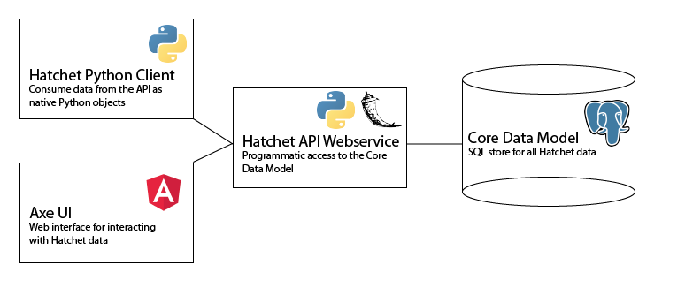

Component Summary
=================
The Hatchet analysis toolkit is comprised of several independent tools
designed to act in a coordinated fashion to provide the user with a seamless
analysis experience.

Core Data Model
---------------
Underlying all of the tools you can use within the Hatchet framework is a
common data model (the Core Data Model) which contains all entities we
track modeled as a relational data schema.

In the "development" environment, the Data Model is contained in a SQLite
database, either in memory or on disk, but in production the database is
scaled up to an AWS Postgres database.

Core Webservice (Hatchet API)
-----------------------------
The Hatchet API is our core webservice, designed to expose the internal
Core Data Model in a consistent fashion to a variety of use cases.

The Hatchet API is implemented as a Python webservice with Flask, SQLAlchemy,
Marshmallow, and Flask-Restplus. The API is documented according to the
OpenAPI 2.0 spec, and can be seen on our Swagger UI page.

Core Python Client
------------------
The Hatchet API ships with a corresponding Python client that exposes the
API data model to users in the form of the ``HatchetClient`` HTTP wrapper.
All responses from the ``HatchetClient`` are in the form of native Python
objects rather than the JSON representation provided by the API. Under
the hood, these objects also contain a client-binding that points back to the
``HatchetClient`` and gives the response entities the ability to be queried
directly.

Analytics Client
----------------
We also provide an analytics-first Python client that wraps the Core Python
Client and allows users to make read-only queries to the Hatchet API and
retrieve data in an analysis-read format. This client directly wraps the
Core Python Client and provides limited functionality when compared to that
client, but has advanced search and data munging capabilities.

Axe UI
------
Not all interactions with the data should be programmatic. Ideas can come from
exploration and hands-on interaction, not just quantitative exploration. To
that end, we also provide a comprehensive UI for data exploration, management,
and grooming. Sometimes the data we consume from external sources will be
messy or incorrect, and the UI is an ideal tool for identifying these issues
and correcting them. The UI is built on top of the Angular JavaScript
framework, and relies heavily on Bootstrap for formatting and ease of
development. The source code for the UI is included in our GitHub repository
under the ``AxeUI`` directory.
